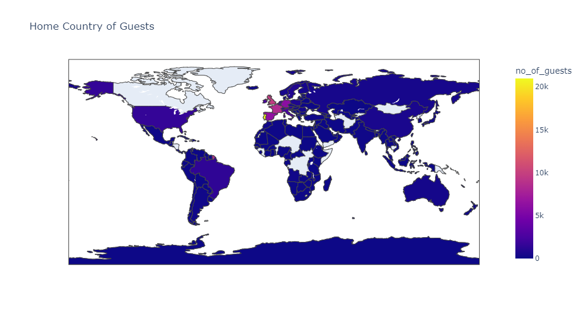
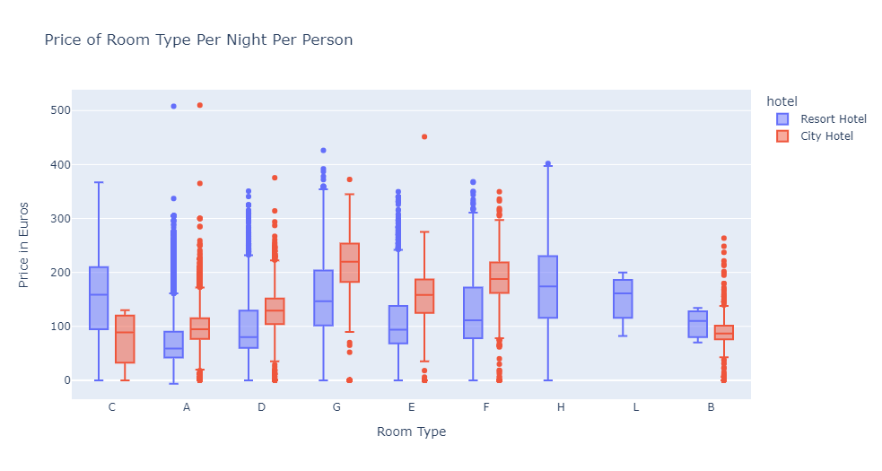

# Predict-The-Cancellation-of-Hotel-Booking

## Table of Content >
  * [Overview](#overview)
  * [Installation](#installation)
  * [Bug / Feature Request](#bug---feature-request)
  * [Future scope of project](#future-scope)

## Overview
This Project Predict Whether the Booked Hotel will be Cancelled or Not.

## Analysis Images

## Installation
The Code is written in Python 3.6.10. If you don't have Python installed you can find it [here](https://www.python.org/downloads/). If you are using a lower version of Python you can upgrade using the pip package, ensuring you have the latest version of pip. To install the required packages and libraries.

## Technologies Used

 

## Bug / Feature Request

If you find a bug, kindly open an [issue](https://github.com/rahulkanojiya/Flight-Fare-Prediction/issues) here by including your search query and the expected result

## Future Scope

* Use multiple Algorithms
* Some App or Webpage Could be Created.
